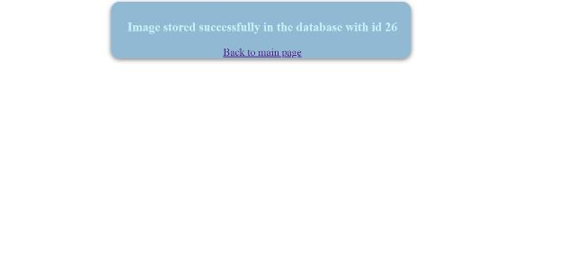

# Image-EncryptDecrypt
This project is a dynamic web application, whose main function is to encrypt and decrypt images in a secure manner 
using AES encryption algorithm.The Frontend of this application is built using HTML and CSS.Java is used for the 
backend development and MYSQL is used for storing the images in a database.It uses JSP(Java Server Pages),
a server side technology,which is responsible for creating dynamic web pages.

